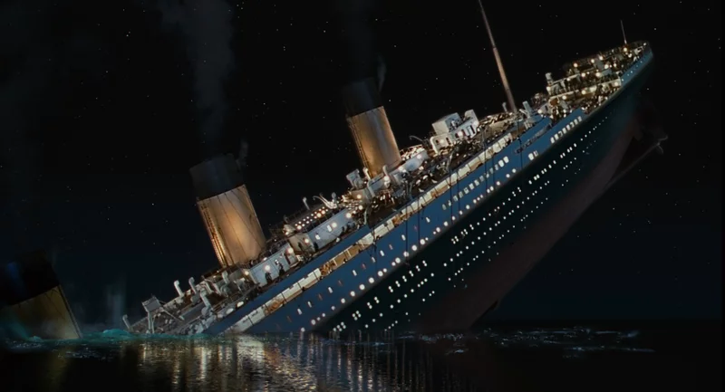

# Machine Learning - Titanic Survival

**Table of Contents**
- [Introduction](#introduction)
- [Motivation](#motivation)
- [Technology Used](#technologyUsed)
- [Build Status](#buildStatus)
- [Features](#features)

## Introduction 
The aim of this project is to create a machine learning model which I can use to predict one's survivability on the titanic depending on certain inputs. The model will be trained on real passenger data from the 1912 titanic. The project will analyse the data, clean the data, create a logistical regression model, predict and evaluate.

## Motivation 
This is a challenge on Kaggle which is a website for data science. I wanted to see how I could utilize my knowledge in regression modelling and statistics with computer programming. Additionally, to gain more exposure in large data manipulation, machine learning, and data visualization.

## Technology Used 
<table>
  <tbody>
    <tr>
      <td>Language</td>
      <td>Python</td>
    </tr>
    <tr>
      <td>Frameworks</td>
      <td>pandas, numpy, seaborn, matplotlib, and sklearn</td>
    </tr>
    <tr>
      <td>Datasets</td>
      <td>passengers.csv (Titanic passenger data from 1912)</td>
    </tr>
  </tbody>
</table>

## Build Status 
Project is completed.

## Features 

Please open up the titanic_survival_chi.ipynb notebook to view the project.
